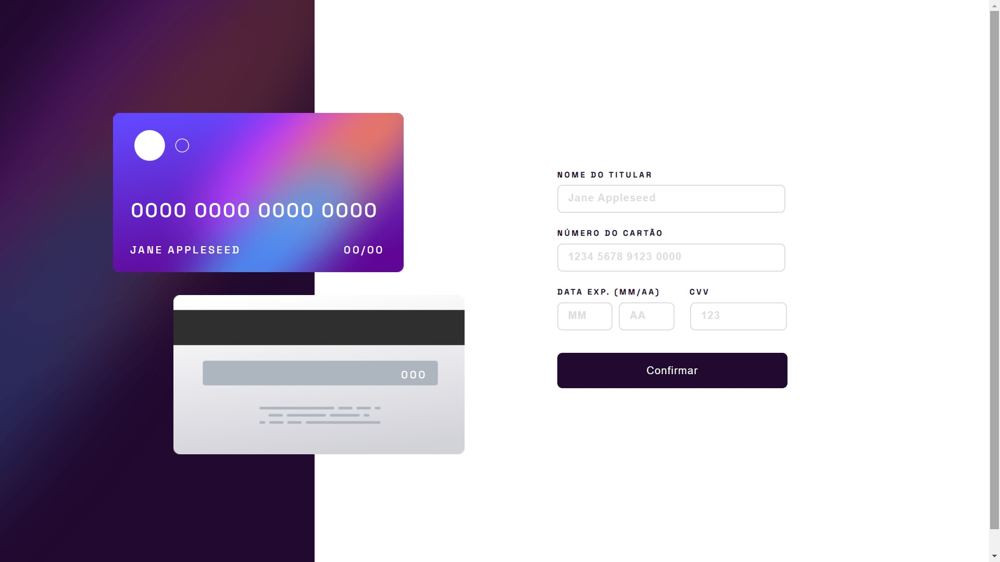
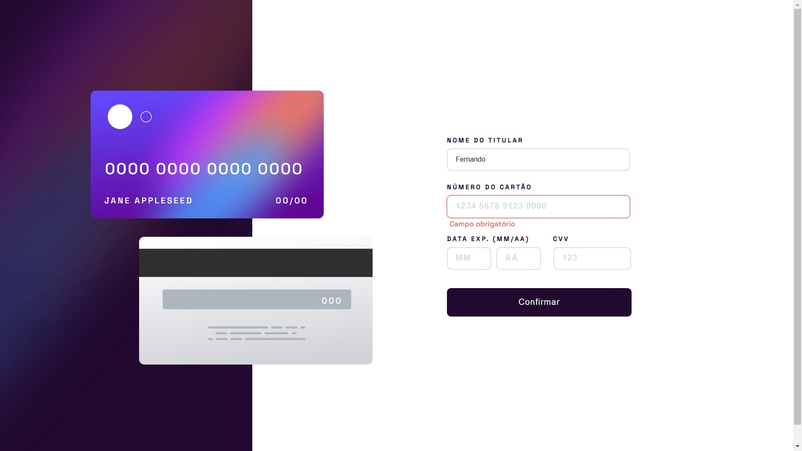

# Solução de formulário de cadastro de cartões interativo.

## Índice

- [Visão Geral](#visão-geral)
  - [O Desafio](#o-desafio)
  - [Screenshot](#screenshot)
  - [Links](#links)
- [Meu processo](#meu-processo)
- [Autor](#autor)

## Visão Geral

### O Desafio

Os usuários deverão ter a capacidade de:

- Preencher o formulário e ver a atualização dos dados do cartão em tempo real;
- Receber mensagens de erro quando o formulário for enviado se:
   - Qualquer campo de entrada está vazio;
   - O número do cartão, data de validade ou campos CVC estão no formato errado;
- Visualizar o layout ideal para o site, dependendo do tamanho da tela do dispositivo;
- Ver os estados de foco para todos os elementos interativos na página.

### Screenshot

### Links

- Site URL: [form-interativo-cadastro](https://form-interativo-cadastro.vercel.app/)

## Meu processo

- [x] Desktop-design
- [x] Estado-completo desktop
- [x] Mobile-design
- [x] Estado-completo mobile
- [x] Estados ativos
- [x] Interação

## Autor

- LinkedIn - [Fernando R Costa](https://www.linkedin.com/in/fernando-r-costa/)
